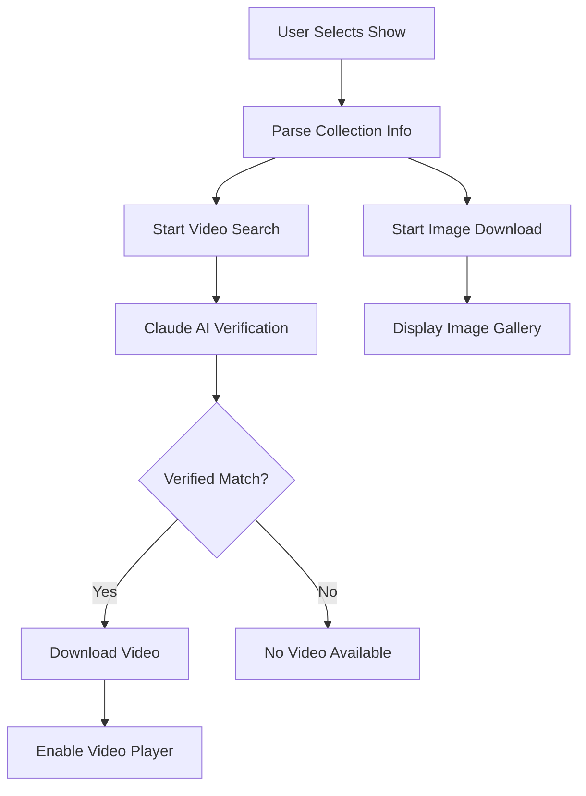

# Fashion Archive System 🎭

An intelligent fashion show archive system designed to preserve and organize fashion history from major fashion weeks around the world.

## Mission 🎯

**Democratizing Fashion History**: Creating a comprehensive, searchable archive of fashion shows to preserve the creative legacy of fashion for researchers, designers, students, and enthusiasts.

- 📚 **Preserve ephemeral runway content** with AI-powered verification
- 🔍 **Enable deep fashion research** across decades of shows
- 🎨 **Support creative inspiration** for designers and students  
- 🌍 **Archive global fashion weeks** (Paris, Milan, London, New York)
- 🤖 **Ensure content authenticity** with semantic AI matching

## Features ✨

### 🎬 AI-Powered Video Verification
- **Claude AI Integration**: Semantic matching of video content to collections
- **Industry Logic**: Distinguishes Couture vs Haute Couture collections
- **Temporal Intelligence**: Year-direction matching (2010 → 2010-2011, not 2009-2010)
- **Quality Control**: Rejects reviews, reactions, and unrelated content

### 🖼️ Professional Image Gallery
- **High-Quality Image Downloads**: Preserves original resolution
- **Interactive Viewing**: Zoom, navigation, and gallery mode
- **Smart Organization**: Automatic collection-based folder structure
- **Efficient Loading**: Thumbnail generation and progressive loading

### 📹 Integrated Video Player
- **Custom Video Player**: Built-in controls with timeline scrubbing
- **Smart Activation**: Only appears when verified video is available
- **Professional Controls**: Play/pause, seeking, and time display
- **Auto-Management**: Cleans up between collections

### 🗂️ Intelligent Organization
- **Collection Detection**: Automatically parses designer, season, year, city
- **Smart Cleanup**: Removes outdated content when switching collections
- **Metadata Preservation**: Keeps original titles and descriptions
- **Cross-Platform**: Works on macOS, Windows, and Linux

## Installation 🚀

### Prerequisites
- Python 3.8+
- Virtual environment (recommended)
- Claude AI API key

### Setup

```bash
# Clone the repository
git clone https://github.com/BhavyaJain108/fashion-archive.git
cd fashion-archive

# Create virtual environment
python -m venv venv
source venv/bin/activate  # On Windows: venv\Scripts\activate

# Install dependencies
pip install -r requirements.txt

# Install additional video support
pip install opencv-python yt-dlp anthropic python-dotenv

# Set up environment
cp .env.example .env
# Edit .env with your Claude API key
```

### Configuration

Create a `.env` file with your credentials:

```bash
CLAUDE_API_KEY=your_claude_api_key_here
```

## Usage 🎪

### Quick Start

```bash
# Run the main application
python fashion_scraper.py
```

### Workflow

1. **Select Season**: Choose from available fashion weeks
2. **Browse Collections**: View designer shows from selected season  
3. **Auto-Archive**: Images and videos download automatically when you click a show
4. **View Content**: 
   - Browse images with gallery controls
   - Watch verified videos with built-in player
   - Use zoom and navigation features

### Video Verification Process

The system uses Claude AI to verify video authenticity:

```
Search Query: "Chanel Couture Fall Winter 2018 Paris"

🔍 Found Videos:
1. Chanel Fall Winter 2018 Haute Couture
2. Chanel Fall Winter 2017 Ready-to-Wear  
3. Chanel Spring Summer 2018 Couture

🤖 Claude Analysis:
- Year Match: 2018 ✅ (rejects 2017 ❌)
- Collection Type: Couture ✅ (rejects Ready-to-Wear ❌)
- Season Match: Fall Winter ✅ (rejects Spring Summer ❌)

✅ Verified: Video #1 matches search criteria
📥 Downloading authentic content...
```

## Technical Architecture 🏗️

### Core Components

```
fashion_scraper.py          # Main GUI application
claude_video_verifier.py    # AI-powered video verification
fashion_video_search.py     # YouTube search functionality
image_downloader.py         # High-quality image acquisition
collection_organizer.py     # Smart folder organization
youtube_downloader.py       # Video download engine
```

### AI Verification Logic

The Claude AI system implements sophisticated fashion industry logic:

- **Couture Distinction**: Differentiates "Couture" from "Haute Couture"
- **Season Matching**: Maps various season formats (FW, Fall/Winter, Autumn)
- **Year Intelligence**: Handles ranges (2018-2019) vs single years (2018)
- **Context Awareness**: Identifies runway shows vs interviews/reviews
- **Brand Recognition**: Handles designer name variations and abbreviations

### Data Flow



## Project Structure 📁

```
fashion-archive/
├── README.md                    # Project documentation
├── requirements.txt             # Python dependencies
├── .env.example                # Environment template
├── .gitignore                  # Git ignore rules
│
├── fashion_scraper.py          # Main GUI application
├── claude_video_verifier.py    # AI video verification
├── fashion_video_search.py     # Video search engine
├── image_downloader.py         # Image download system
├── collection_organizer.py     # Folder organization
├── youtube_downloader.py       # Video download engine
├── fashion_llm_analyzer.py     # LLM analysis tools
│
├── video_player_widget.py      # Video player component
├── video_search_test.py        # Video search testing
└── config_example.json         # Configuration template
```

## API Integration 🔌

### Claude AI
- **Purpose**: Semantic video verification
- **Model**: Claude-3-Haiku for cost-effectiveness
- **Function**: Determines if videos match collection criteria

### YouTube Data
- **Source**: Direct HTML parsing (no API key required)
- **Method**: Scrapes search results for video metadata
- **Verification**: Cross-references with Claude AI

## Contributing 🤝

We welcome contributions to help preserve fashion history!

### Areas for Contribution
- **Additional Data Sources**: Integrate more fashion week archives
- **Enhanced AI Logic**: Improve verification accuracy
- **UI/UX Improvements**: Better user experience design
- **Performance Optimization**: Faster downloads and processing
- **Documentation**: Help expand documentation and tutorials

### Development Setup

```bash
# Fork the repository
git clone https://github.com/YourUsername/fashion-archive.git
cd fashion-archive

# Create feature branch
git checkout -b feature/your-feature-name

# Make changes and test
python fashion_scraper.py

# Commit and push
git add .
git commit -m "Add: your feature description"
git push origin feature/your-feature-name

# Create pull request
```

## Legal & Ethics ⚖️

### Responsible Archiving
- **Educational Purpose**: System designed for research and education
- **Respect Copyright**: Only archives publicly available content
- **Source Attribution**: Preserves original titles and creator information
- **Fair Use**: Follows fair use principles for academic and research purposes

### Data Handling
- **No Personal Data**: System does not collect personal information
- **Public Content Only**: Archives publicly accessible fashion show content
- **Metadata Preservation**: Maintains original source information
- **Transparent Process**: All verification steps are logged and visible

## Roadmap 🗺️

### Version 2.0 (Planned)
- [ ] **Database Integration**: PostgreSQL backend for metadata
- [ ] **Advanced Search**: Full-text search across collections
- [ ] **API Development**: REST API for programmatic access
- [ ] **Mobile App**: React Native companion app
- [ ] **ML Enhancement**: Custom models for fashion-specific recognition

### Version 2.1 (Future)
- [ ] **Multi-Language Support**: International fashion week coverage
- [ ] **Collaborative Features**: Community-driven archiving
- [ ] **Advanced Analytics**: Trend analysis and insights
- [ ] **Integration Plugins**: Export to research databases

## Support 💬

- **Documentation**: Check this README and inline code comments
- **Issues**: Report bugs via GitHub Issues
- **Discussions**: Join GitHub Discussions for questions
- **Email**: Contact maintainers for collaboration opportunities

## License 📄

This project is open source and available under the [MIT License](LICENSE).

## Acknowledgments 🙏

- **Fashion Industry**: For creating the beautiful content we preserve
- **Anthropic Claude**: For providing intelligent content verification
- **Open Source Community**: For the tools and libraries that make this possible
- **Fashion Researchers**: Who inspire the mission to preserve fashion history

---

**Building a lasting archive of fashion's creative legacy.** 🎭✨

*Made with ❤️ for the fashion community*